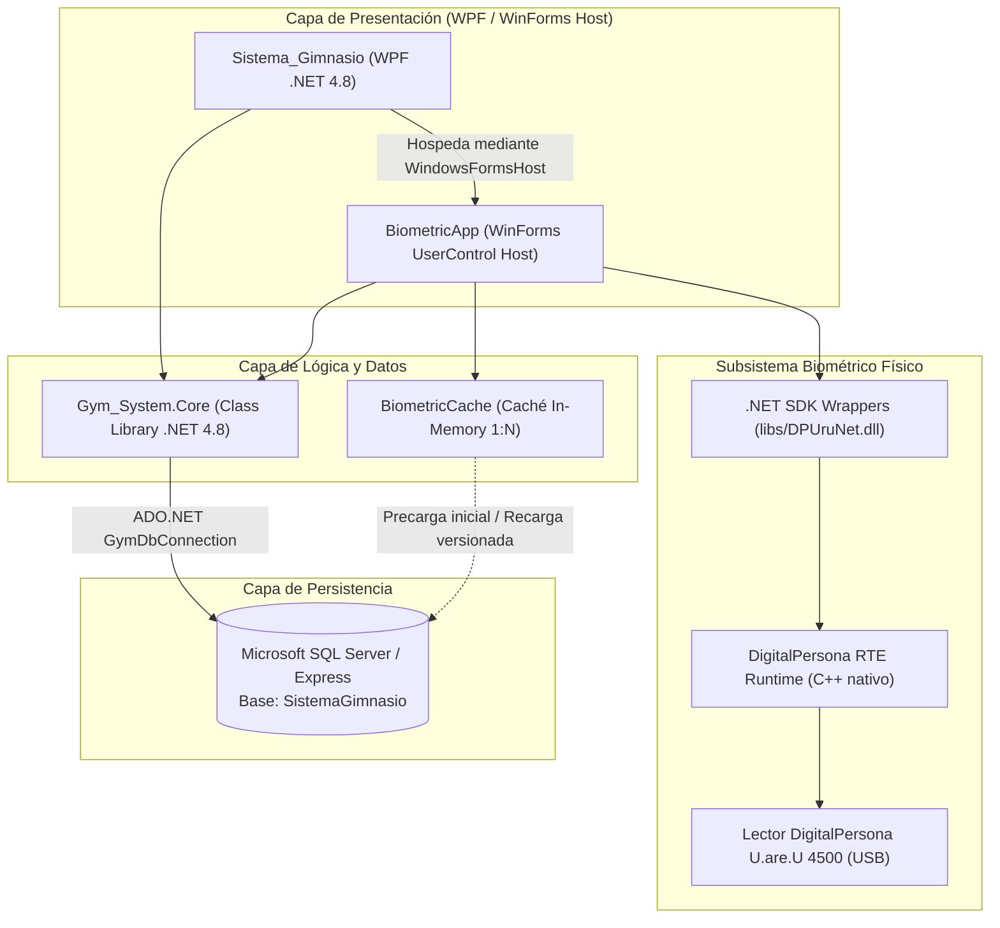

# Manual Integral de Despliegue e Instalación — Sistema Gimnasio

> [!NOTE]
> **Documento Operativo — Fase 4.** Este manual detalla los procedimientos técnicos y operativos necesarios para el despliegue del sistema en estaciones de recepción, puestos de control biométrico y servidores de base de datos. Se encuentra redactado en español y alineado con los estándares del repositorio.

---

## 1. Arquitectura y Topología de Despliegue

El **Sistema de Administración de Gimnasio** es una solución de escritorio cliente para entornos Windows, estructurada en tres capas de software y un subsistema de hardware biométrico:



### Topologías de Implementación

1. **Topología Monopuesto (Recepción / Mostrador Todo en Uno):**
   - La estación de trabajo aloja el motor de base de datos **SQL Server Express** local (`.\SQLEXPRESS01`), la aplicación de escritorio y el lector biométrico conectado directamente por USB.
   - Es el escenario por defecto y más habitual en gimnasios de tamaño mediano o pequeño.
   - Modo de autenticación recomendado: **Windows Authentication (`Integrated Security=True`)**.

2. **Topología Distribuida / Red Local (Servidor + Terminales de Control):**
   - Un equipo dedicado o servidor en LAN aloja la instancia de **SQL Server**.
   - Múltiples terminales (recepción de ventas, torniquete de acceso biométrico con PC embebido) ejecutan la aplicación cliente conectándose al servidor central a través de la red local (puerto 1433 TCP).

---

## 2. Requisitos Previos del Sistema

### Hardware
- **Procesador:** Intel Core i3 / AMD Ryzen 3 o superior (x86 / x64).
- **Memoria RAM:** Mínimo 4 GB (se recomiendan 8 GB para ejecución fluida con SQL Server Express).
- **Almacenamiento:** 2 GB de espacio libre en disco (SSD recomendado).
- **Puertos:** Puerto USB 2.0 / 3.0 tipo A energizado para el lector biométrico.
- **Dispositivo Biométrico:** Lector óptico de huellas dactilares **DigitalPersona U.are.U 4500 Fingerprint Reader**.

### Software y Sistema Operativo
- **Sistema Operativo:** Windows 10 (versión 1809 o superior) / Windows 11 (64-bit recomendado).
- **Framework Base:** Microsoft .NET Framework 4.8 Runtime (preinstalado en Windows 10 recientes o descargable desde el canal oficial de Microsoft).
- **Herramientas de Compilación (si se despliega desde código fuente):**
  - Visual Studio 2022 (Community, Professional o Enterprise) con la carga de trabajo *Desarrollo de escritorio de .NET*, o
  - Visual Studio Build Tools 2022 / 2026 con MSBuild y SDK .NET Framework 4.8.
- **Motor de Base de Datos:**
  - Microsoft SQL Server 2019 / 2022 o SQL Server Express 2019 / 2022.

---

## 3. Puesta en Marcha de la Base de Datos

### 3.1. Instalación de SQL Server Express
1. Descargue el instalador oficial de **SQL Server Express** desde el portal de descargas de Microsoft.
2. Seleccione el tipo de instalación **Básica** o **Personalizada**.
3. Si utiliza una instalación personalizada, asigne un nombre a la instancia o conserve la instancia por defecto. El proyecto está configurado de fábrica para la instancia nombrada:
   ```text
   .\SQLEXPRESS01
   ```
   *(Nota: si su instancia se denomina `.\SQLEXPRESS` o `(local)`, deberá reflejarlo en los archivos de configuración como se detalla en la sección 4).*
4. En la configuración de autenticación, seleccione **Modo mixto (Autenticación de SQL Server y de Windows)** o **Modo de autenticación de Windows**.

### 3.2. Configuración de Protocolos de Red (SQL Server Configuration Manager)
Si las terminales de acceso se conectan mediante red local:
1. Abra **SQL Server Configuration Manager**.
2. Navegue a **Configuración de red de SQL Server** > **Protocolos de SQLEXPRESS01** (o el nombre de su instancia).
3. Asegúrese de que **Memoria compartida** (*Shared Memory*) esté **Habilitada**.
4. Habilite **TCP/IP** y **Canalizaciones con nombre** (*Named Pipes*).
5. En las propiedades de **TCP/IP**, pestaña **Direcciones IP**, asegúrese de que `IPAll` tenga configurado el puerto TCP `1433` (o un puerto estático definido por su administrador de redes).
6. Inicie o reinicie el servicio **SQL Server (SQLEXPRESS01)**.
7. Si utiliza instancias con nombre a través de la red, inicie el servicio **SQL Server Browser** y configúrelo en inicio Automático.

### 3.3. Creación de la Base de Datos mediante Script DDL
El esquema formal de la base de datos se encuentra en el repositorio en:
`database/SistemaGimnasio.sql`

#### Opción A: Mediante SQLCMD (Línea de comandos / PowerShell)
Abra PowerShell o CMD como Administrador y ejecute:
```powershell
sqlcmd -S .\SQLEXPRESS01 -E -i "database/SistemaGimnasio.sql"
```
*(El modificador `-E` utiliza autenticación integrada de Windows con el usuario administrador actual).*

#### Opción B: Mediante SQL Server Management Studio (SSMS) o Azure Data Studio
1. Inicie SSMS y conéctese a la instancia `.\SQLEXPRESS01`.
2. Abra el archivo [SistemaGimnasio.sql](../database/SistemaGimnasio.sql).
3. Presione **F5** o haga clic en **Ejecutar**.
4. Compruebe que la salida confirme la creación de la base `SistemaGimnasio` y las tablas correspondientes.

### 3.4. Verificación de Objetos Creados
Compruebe la existencia de las 4 tablas principales y sus restricciones:
- `dbo.Membresias`: Catálogo de tipos de membresía, duración y precio.
- `dbo.Miembros`: Información del socio, estado, vigencias y huella biométrica (`NVARCHAR(MAX)`).
- `dbo.Pagos`: Historial de transacciones financieras registradas.
- `dbo.Visitas`: Control de accesos de visitas de pase diario.
- Claves foráneas: `FK_Pago_Membresia` con borrado en cascada (`ON DELETE CASCADE`) y `FK_Miembro_Membresia` sin cascada (restricción referencial estándar sin eliminación en cascada para preservar la integridad de los socios, alineado con `database/SistemaGimnasio.sql`).

---

## 4. Política de Seguridad y Permisos Mínimos (Least-Privilege)

> [!IMPORTANT]
> **Principio de Mínimo Privilegio:** La aplicación en tiempo de ejecución **NUNCA** debe ejecutarse con privilegios administrativos (`sysadmin` o `sa`). Los privilegios de administración del motor se reservan exclusivamente para la instalación inicial y el mantenimiento de infraestructura.

### 4.1. Separación de Roles
1. **Rol de Aprovisionamiento e Instalación:**
   - Usuario: Administrador del sistema / DBA.
   - Permisos requeridos: `sysadmin` o `dbcreator` para crear la base de datos y ejecutar el script DDL inicial.
2. **Rol de Operación en Runtime (Aplicación Gym System):**
   - Usuario: Cuenta de servicio local, usuario de Windows del operador o login dedicado de SQL.
   - Permisos requeridos: Exclusivamente lectura y escritura de datos sobre las 4 tablas de la base de datos `SistemaGimnasio`.

### 4.2. Escenario 1: Autenticación Integrada de Windows (Configuración Predeterminada)
La configuración estándar del repositorio utiliza `Integrated Security=True`. En este esquema, SQL Server autentica el proceso utilizando el token de seguridad del usuario de Windows que ejecuta la aplicación.

Para autorizar a un usuario de Windows (por ejemplo, el usuario local de recepción `RECEPCION-PC\OperadorGym`) con mínimos privilegios:

```sql
USE master;
GO

-- 1. Crear el Login a partir de la cuenta de Windows
IF NOT EXISTS (SELECT * FROM sys.server_principals WHERE name = N'RECEPCION-PC\OperadorGym')
BEGIN
    CREATE LOGIN [RECEPCION-PC\OperadorGym] FROM WINDOWS;
END;
GO

USE SistemaGimnasio;
GO

-- 2. Crear el Usuario de base de datos asociado al Login
IF NOT EXISTS (SELECT * FROM sys.database_principals WHERE name = N'OperadorGymUser')
BEGIN
    CREATE USER [OperadorGymUser] FOR LOGIN [RECEPCION-PC\OperadorGym];
END;
GO

-- 3. Asignar ÚNICAMENTE roles de lectura y escritura de datos
ALTER ROLE db_datareader ADD MEMBER [OperadorGymUser];
ALTER ROLE db_datawriter ADD MEMBER [OperadorGymUser];
GO

-- 4. DENEGAR explícitamente permisos DDL y de control
DENY ALTER, DROP, CONTROL TO [OperadorGymUser];
GO
```

### 4.3. Escenario 2: Autenticación SQL Server (Entornos Distribuidos)
Si la estación cliente se conecta mediante Autenticación SQL, cree un Login con privilegios estrictamente limitados:

```sql
USE master;
GO

-- 1. Crear Login seguro (reemplace <PasswordSeguro> por una contraseña robusta generada en el entorno)
IF NOT EXISTS (SELECT * FROM sys.server_principals WHERE name = N'GymAppRuntimeUser')
BEGIN
    CREATE LOGIN [GymAppRuntimeUser]
    WITH PASSWORD = N'<PasswordSeguro>',
         CHECK_EXPIRATION = ON,
         CHECK_POLICY = ON;
END;
GO

USE SistemaGimnasio;
GO

-- 2. Mapear Usuario a la base de datos
IF NOT EXISTS (SELECT * FROM sys.database_principals WHERE name = N'GymAppRuntimeUser')
BEGIN
    CREATE USER [GymAppRuntimeUser] FOR LOGIN [GymAppRuntimeUser];
END;
GO

-- 3. Conceder permisos estrictos de DML (SELECT, INSERT, UPDATE, DELETE)
ALTER ROLE db_datareader ADD MEMBER [GymAppRuntimeUser];
ALTER ROLE db_datawriter ADD MEMBER [GymAppRuntimeUser];
GO

-- 4. Restricción preventiva
DENY ALTER, DROP, CONTROL TO [GymAppRuntimeUser];
GO
```

> [!WARNING]
> Si adopta Autenticación SQL, debe proteger el archivo `App.config` en el disco de la estación de trabajo mediante permisos NTFS restrictivos (solo lectura para el usuario operador) o aplicar cifrado de sección mediante la herramienta oficial de .NET `aspnet_regiis -pef "connectionStrings"`.

---

## 5. Configuración de Cadenas de Conexión (`GymDbConnection`)

El sistema utiliza la clave centralizada `GymDbConnection`. Existen dos archivos de configuración que deben mantenerse **estrictamente idénticos**:

1. [Sistema_Gimnasio/App.config](../Sistema_Gimnasio/App.config): Configuración del ejecutable principal WPF (`Sistema_Gimnasio.exe`).
2. [BiometricApp/BiometricApp/BiometricApp/App.config](../BiometricApp/BiometricApp/BiometricApp/App.config): Configuración utilizada por el ejecutable de pruebas biométricas (`BiometricApp.exe`).

### Estructura de la Cadena de Conexión

#### Para Autenticación de Windows (Predeterminada):
```xml
<connectionStrings>
    <add name="GymDbConnection"
         connectionString="Data Source=.\SQLEXPRESS01;Initial Catalog=SistemaGimnasio;Integrated Security=True"
         providerName="System.Data.SqlClient" />
</connectionStrings>
```

#### Para Autenticación SQL Server en Red:
```xml
<connectionStrings>
    <add name="GymDbConnection"
         connectionString="Data Source=192.168.1.50,1433;Initial Catalog=SistemaGimnasio;User ID=GymAppRuntimeUser;Password=<PasswordSeguro>;Integrated Security=False;Encrypt=False;TrustServerCertificate=True"
         providerName="System.Data.SqlClient" />
</connectionStrings>
```

> [!TIP]
> Tras modificar cualquier cadena de conexión, ejecute siempre el script de consistencia del repositorio para verificar que no existan discrepancias:
> `powershell -ExecutionPolicy Bypass -File scripts/verify-reproducibility.ps1`

---

## 6. Instalación y Configuración de Hardware Biométrico (DigitalPersona U.are.U 4500)

El lector **DigitalPersona U.are.U 4500** es un sensor óptico USB de alta precisión que captura minucias dactilares y las convierte en plantillas biométricas compatibles con el estándar ANSI/ISO.

### 6.1. Adquisición del Runtime y Controladores Oficiales
> [!CAUTION]
> **Paso Manual del Proveedor:** Los controladores y el paquete de tiempo de ejecución (*RTE - Run-Time Environment*) son propiedad comercial de **HID Global / DigitalPersona (Crossmatch)**. No se encuentran incluidos ni deben subirse al repositorio Git.
>
> El operador debe obtener el paquete instalador oficial (**DigitalPersona One Touch for Windows RTE** o **DigitalPersona U.are.U RTE for Windows**, versión 3.0 o superior) a través de los canales autorizados de HID Global o mediante los medios de instalación provistos con el hardware adquirido.

### 6.2. Instalación de Drivers en el Sistema Operativo
1. Desconecte el lector USB del equipo antes de iniciar la instalación de los controladores.
2. Ejecute el instalador oficial del fabricante (`Setup.exe` provisto por HID Global).
3. Seleccione la arquitectura correspondiente al sistema operativo:
   - Para Windows de 64 bits (x64), instale el paquete RTE x64.
   - Si utiliza sistemas operativos de 32 bits (x86), seleccione el paquete RTE x86.
4. Complete el asistente de instalación y reinicie el equipo si el instalador lo solicita.
5. Conecte el lector DigitalPersona U.are.U 4500 en un puerto USB directo del equipo (evite concentradores o *hubs* USB pasivos sin alimentación).

### 6.3. Verificación en el Administrador de Dispositivos
1. Presione `Win + X` y seleccione **Administrador de dispositivos** (`devmgmt.msc`).
2. Compruebe que el lector figure correctamente reconocido en una de las siguientes ramas:
   - **Dispositivos biométricos** > *DigitalPersona U.are.U 4500 Fingerprint Reader*, o
   - **Controladoras de bus serie universal (USB)** > *DigitalPersona Fingerprint Reader*.
3. Verifique en las propiedades del dispositivo que el estado indique: *"Este dispositivo funciona correctamente"*.
4. Identificadores de hardware esperados: `USB\VID_05BA&PID_000A`.

### 6.4. Ensamblados Administrados en `libs/` y Arquitectura del SDK
El repositorio incluye en la carpeta `libs/` los ensamblados administrados de interoperabilidad .NET:
- [libs/DPUruNet.dll](../libs/DPUruNet.dll): Núcleo de reconocimiento, comparación 1:1, 1:N y gestión de plantillas FMD.
- [libs/DPCtlUruNet.dll](../libs/DPCtlUruNet.dll): Controles de captura de interfaz gráfica y eventos de enrolamiento.
- [libs/DPXUru.dll](../libs/DPXUru.dll): Transformaciones y utilidades nativas extendidas.
- [libs/DPCtlXUru.dll](../libs/DPCtlXUru.dll): Controles extendidos de interfaz.

**Relación Arquitectónica:**
Las DLLs de `libs/` son wrappers administrados en C#/.NET. Estas librerías delegan la interacción física y el procesamiento matemático a los módulos nativos C++ instalados en el sistema por el RTE oficial (`dpfpapi.dll`, `dpfpenrl.dll`, `dpfpver.dll` en `%WINDIR%\System32` o `%WINDIR%\SysWOW64`).

> [!NOTE]
> Los proyectos del repositorio están configurados para compilar en plataforma **AnyCPU**. Los wrappers de `libs/` negocian en tiempo de ejecución la carga de los componentes nativos según la bitedad del proceso (32 o 64 bits).

### 6.5. Validación del Lector desde la Aplicación
1. **Detección Automática:** Al abrir la ventana de control de acceso ([SistemaAcceso.xaml.cs](../Sistema_Gimnasio/SistemaAcceso.xaml.cs)), el componente `FingerprintManager` inicializa la colección de lectores mediante `ReaderCollection.GetReaders()`.
2. **Lector Presente:** El lector encenderá su luz guía roja en el prisma óptico y la interfaz mostrará el estado listo para captura.
3. **Tolerancia a Desconexión (Fase 3):** Si el lector no está conectado o se desconecta físicamente en caliente, la aplicación captura los códigos de error `DP_DEVICE_FAILURE` y `DP_INVALID_DEVICE` de forma segura, evitando cierres inesperados del proceso y manteniendo la funcionalidad de búsqueda manual por teclado.

---

## 7. Compilación y Despliegue de Ejecutables

### 7.1. Restauración de Paquetes NuGet
Desde la raíz del repositorio, restaure las dependencias externas con MSBuild:
```powershell
msbuild Sistema_Gimnasio.sln /t:restore /p:RestorePackagesConfig=true
```

### 7.2. Compilación de la Solución
Compile la solución en modo `Release` (o `Debug` para pruebas de desarrollo):
```powershell
msbuild Sistema_Gimnasio.sln /p:Configuration=Release
```
*Ruta explícita con Visual Studio 2022:*
```powershell
& "C:\Program Files\Microsoft Visual Studio\18\Community\MSBuild\Current\Bin\MSBuild.exe" Sistema_Gimnasio.sln /p:Configuration=Release
```

### 7.3. Directorio de Distribución Binaria
Al compilar en modo `Release`, los artefactos de ejecución se generan en:
`Sistema_Gimnasio/bin/Release/`

Dicho directorio contiene:
- `Sistema_Gimnasio.exe` (Ejecutable principal)
- `Sistema_Gimnasio.exe.config` (Copia del `App.config` con la cadena de conexión)
- `Gym_System.Core.dll` (Lógica de acceso a datos y reglas de negocio)
- `BiometricApp.dll` (Controles biométricos y motor de caché)
- `DPUruNet.dll`, `DPCtlUruNet.dll`, `DPXUru.dll`, `DPCtlXUru.dll` (Copiadas automáticamente desde `libs/`)
- Dependencias de paquetes NuGet (`MahApps.Metro.IconPacks.*`, `NodaTime.dll`, `System.Drawing.Common.dll`, etc.)

---

## 8. Verificación Post-Despliegue

Finalizada la instalación y configuración, ejecute la siguiente batería de validación para certificar la estación de trabajo:

1. **Chequeo de Consistencia Estática:**
   ```powershell
   powershell -ExecutionPolicy Bypass -File scripts/verify-reproducibility.ps1
   ```
2. **Chequeo de Despliegue y Documentación (Fase 4):**
   ```powershell
   powershell -ExecutionPolicy Bypass -File scripts/test-phase4.ps1
   ```
3. **Prueba de Enrolamiento:**
   - Inicie `Sistema_Gimnasio.exe`.
   - Diríjase a **Miembros** > **Agregar Miembro**.
   - Presione el botón de captura de huella y realice las 4 lecturas requeridas por el asistente. Verifique que la plantilla se serialice y guarde en la base de datos.
4. **Prueba de Acceso Biométrico:**
   - Abra la ventana de **Sistema de Acceso**.
   - Coloque el dedo recién enrolado en el lector.
   - Compruebe que la caché in-memory (`BiometricCache`) reconozca al socio en tiempo submétrico (< 100 ms) y muestre su estado de vigencia.
