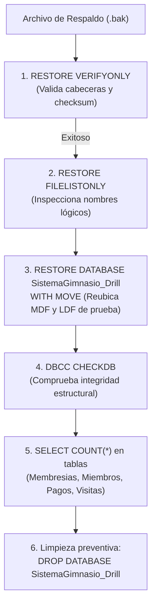
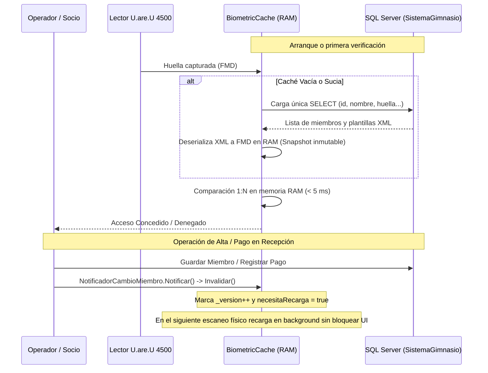

# Manual de Operación, Respaldos y Mantenimiento — Sistema Gimnasio

> [!NOTE]
> **Documento Operativo — Fase 4.** Esta guía define las políticas de respaldos, procedimientos de restauración, mantenimiento preventivo de la base de datos y mejores prácticas para la conservación del hardware biométrico y la caché en memoria.

---

## 1. Estrategia Integral de Respaldos (Backups)

La continuidad operativa del gimnasio y la integridad de su información contable y biométrica dependen de una disciplina estricta de copias de seguridad.

### 1.1. Modelo de Recuperación de SQL Server: `SIMPLE` Recomendado

En Microsoft SQL Server, el modelo de recuperación (*Recovery Model*) define cómo se gestiona el registro de transacciones (*Transaction Log* o archivo `.ldf`):

- **Modelo `FULL` (Completo):** Mantiene todas las transacciones en el log hasta que se realice un respaldo explícito del log de transacciones. En una estación de trabajo de gimnasio que no cuenta con un DBA dedicado ejecutando respaldos de log cada 15 minutos, el archivo `.ldf` crecerá indefinidamente hasta agotar el espacio en disco y detener el servicio.
- **Modelo `SIMPLE` (Simple) [RECOMENDADO]:** Reutiliza automáticamente el espacio del log de transacciones tras cada punto de control (*checkpoint*), manteniendo el archivo `.ldf` en un tamaño reducido y predecible. Permite restaurar al momento del último respaldo completo o diferencial.

Para verificar y configurar el modelo de recuperación en la base de datos `SistemaGimnasio`:
```sql
USE master;
GO
ALTER DATABASE [SistemaGimnasio] SET RECOVERY SIMPLE;
GO
```

### 1.2. Esquema de Respaldos y Frecuencia

| Tipo de Respaldo | Frecuencia | Momento Sugerido | Propósito |
| :--- | :--- | :--- | :--- |
| **Completo (Full)** | Diario | Al cierre de caja / fin de jornada | Copia integral de todas las tablas, esquemas e índices. |
| **Diferencial (Opcional)**| Cada 4 a 6 horas | Durante el cambio de turno | Registra únicamente los cambios desde el último respaldo completo. |

### 1.3. Script Seguro de Respaldo Parametrizado

El repositorio incluye el script seguro de respaldo en:
[scripts/backup-database.sql](../scripts/backup-database.sql)

**Características de Seguridad y Guardrails:**
- **No se ejecuta por defecto:** Requiere obligatoriamente el parámetro `$(BackupFolder)` y falla cerrado si este no se suministra.
- **Sin rutas hardcodeadas:** No asume rutas por defecto en `Program Files` ni carpetas de usuarios específicos.
- **No sobreescritura accidental:** Emplea `NOFORMAT, NOINIT` y genera nombres de archivo únicos con marca de tiempo ISO y sufijo GUID para evitar sobrescribir respaldos existentes.
- **Integridad verificada:** Incluye la cláusula `WITH CHECKSUM` para validar cada página respaldada y ejecuta automáticamente `RESTORE VERIFYONLY` al concluir la copia.

**Ejecución Segura vía SQLCMD (Requiere Carpeta Explícita):**
```powershell
sqlcmd -S .\SQLEXPRESS01 -E -v BackupFolder="D:\Backups\Gym" -i "scripts/backup-database.sql"
```

> [!WARNING]
> La ejecución sin suministrar `-v BackupFolder="..."` fallará de manera cerrada con un error crítico para evitar la creación de archivos en ubicaciones no deseadas.

### 1.4. Automatización con PowerShell y Gestión de Retención

Para programar respaldos diarios desatendidos con eliminación automática de copias obsoletas, utilice el script:
[scripts/Backup-Database.ps1](../scripts/Backup-Database.ps1)

**Uso:**
```powershell
# Simulación segura (WhatIf no crea directorios ni altera el sistema de archivos):
powershell -ExecutionPolicy Bypass -File scripts/Backup-Database.ps1 -ServerInstance ".\SQLEXPRESS01" -BackupDirectory "D:\Backups\Gym" -WhatIf

# Ejecución real con retención de 14 días en carpeta específica:
powershell -ExecutionPolicy Bypass -File scripts/Backup-Database.ps1 -ServerInstance ".\SQLEXPRESS01" -BackupDirectory "D:\Backups\Gym" -RetentionDays 14
```

**Parámetros y Guardrails:**
- `-ServerInstance`: Instancia de SQL Server (por defecto `.\SQLEXPRESS01`).
- `-DatabaseName`: Base de datos objetivo (`SistemaGimnasio`).
- `-BackupDirectory`: Carpeta obligatoria donde se depositan los `.bak`. Valida la sintaxis de la ruta sin crear directorios prematuramente.
- `-RetentionDays`: Días que se conservan los archivos antes de ser depurados automáticamente (por defecto 14).
- `-WhatIf`: Simula todas las acciones (`New-Item`, `sqlcmd`, `Remove-Item`) bajo `ShouldProcess`, garantizando cero modificaciones al sistema de archivos durante la inspección.

### 1.5. Política de Retención y Regla 3-2-1
- **Regla 3-2-1 Adaptada:**
  - **3 copias** de los datos (la base de datos activa y 2 respaldos).
  - **2 soportes distintos** (el disco local del servidor/PC y un medio extraíble o almacenamiento en red).
  - **1 copia fuera de la estación principal** (disco externo USB rotativo o sincronización segura en almacenamiento en la nube).
- **Permisos Requeridos:** Para ejecutar respaldos de SQL Server, la cuenta ejecutora debe pertenecer al rol de base de datos `db_backupoperator` o al rol de servidor `sysadmin`.

---

## 2. Procedimiento de Restauración y Simulacros Periódicos (Restore Drills)

> [!CAUTION]
> **REGLA DE ORO DE SEGURIDAD OPERATIVA:**
> **NUNCA pruebe un archivo de respaldo restaurándolo sobre la base de datos activa `SistemaGimnasio`.**
> Una prueba sobre producción sobrescribiría datos en caliente y causaría la pérdida irrecuperable de transacciones recién emitidas. Los ejercicios de comprobación deben realizarse EXCLUSIVAMENTE mediante el simulacro aislado (*Restore Drill*).

### 2.1. Simulacro Aislado (Restore Drill)
Para verificar que un archivo `.bak` es genuinamente funcional y que no presenta corrupción silente, ejecute un simulacro de restauración sobre una base de prueba aislada denominada `SistemaGimnasio_Drill`.

El repositorio provee el script:
[scripts/restore-drill.sql](../scripts/restore-drill.sql)

**Guardrails del Simulacro:**
- **Aislamiento Total:** Restaura únicamente en `[SistemaGimnasio_Drill]` con reubicación física de archivos (`WITH MOVE`), garantizando que la base de producción permanezca intacta.
- **Prohibición de Producción:** Valida activamente que la base objetivo jamás sea `SistemaGimnasio`.
- **Falla Cerrada ante Base Previa:** Si `[SistemaGimnasio_Drill]` ya existe de una prueba previa, el script se rehúsa a borrarla o sobrescribirla a menos que se pase explícitamente el flag `-v ConfirmOverwriteExistingDrillDb="YES"`.

**Flujo Operativo del Simulacro:**


**Comando de Ejecución del Simulacro:**
```powershell
# Caso 1: Primera ejecución (base drill no existe):
sqlcmd -S .\SQLEXPRESS01 -E -v BackupFile="D:\Backups\Gym\SistemaGimnasio_Full_20260917_230000.bak" -i "scripts/restore-drill.sql"

# Caso 2: Re-ejecución con confirmación explícita para recrear base drill previa:
sqlcmd -S .\SQLEXPRESS01 -E -v BackupFile="D:\Backups\Gym\SistemaGimnasio_Full_20260917_230000.bak" -v ConfirmOverwriteExistingDrillDb="YES" -i "scripts/restore-drill.sql"
```

El script reportará el conteo de registros restaurados en cada tabla sin interferir en la operación de la base de datos real.

---

### 2.2. Procedimiento Excepcional de Emergencia Manual: Recuperación ante Desastre (Disaster Recovery)

> [!CAUTION]
> **PROCEDIMIENTO EXCEPCIONAL DE EMERGENCIA — NO EJECUTAR COMO COMANDO POR DEFECTO.**
> Esta sección describe el protocolo manual ante contingencia severa (destrucción física del hardware, pérdida de disco o reinstalación de servidor desde cero).
> **Bajo ninguna circunstancia debe ejecutarse de forma rutinaria o desatendida.**

#### Checklist Obligatorio Previo a la Restauración de Emergencia
Antes de intentar cualquier operación de restauración sobre el ambiente de producción, el operador debe cumplir estrictamente la siguiente lista de verificación:

1. [ ] **Verificación y declaración formal de desastre:** Confirmar fehacientemente que la base de datos activa es inoperable o ha sufrido daño irrecuperable (no confundir con caídas transitorias de red o servicio SQL detenido).
2. [ ] **Respaldo de emergencia previo (*Tail-Log Backup* / Copia Fría):** Si la base de datos o el disco aún responden mínimamente, intentar generar una copia de la cola del log o un copiado en frío de los archivos `.mdf` y `.ldf` antes de alterarlos.
3. [ ] **Validación previa obligatoria mediante Restore Drill:** Probar el archivo de respaldo candidato en un entorno aislado ejecutando `scripts/restore-drill.sql`. Si el archivo falla en el simulacro, **NO LO UTILICE EN PRODUCCIÓN**.
4. [ ] **Validación de instancia y base de datos objetivo:** Ejecutar `SELECT @@SERVERNAME, DB_NAME();` para asegurar de manera inequívoca que se encuentra en el servidor correcto y no en otra máquina de la red.
5. [ ] **Confirmación interactiva fuera de SQL:** La restauración en producción requiere validación de dos pasos y confirmación interactiva manual fuera del motor SQL.

#### Protocolo de Ejecución Manual con Confirmación Interactiva

##### Paso 1: Confirmación Interactiva en PowerShell (Fuera de SQL)
El operador debe validar explícitamente la intención de restaurar mediante un control interactivo:

```powershell
# Control interactivo de seguridad fuera de SQL:
$Confirmacion = Read-Host "PELIGRO: Va a restaurar la base de PRODUCCIÓN. Escriba 'CONFIRMO_RESTAURACION_PRODUCCION' para continuar"
if ($Confirmacion -ne "CONFIRMO_RESTAURACION_PRODUCCION") {
    throw "Operación cancelada por el operador. No se realizaron cambios."
}
Write-Host "Confirmación validada. Proceda con la sustitución controlada de variables." -ForegroundColor Yellow
```

##### Paso 2: Ejecución Controlada con Variables Parametrizadas y Placeholders Explícitos
No ejecute comandos directos con nombres fijos sin validación de la base de datos objetivo. Utilice la siguiente plantilla que exige sustitución obligatoria:

```sql
-- PLANTILLA DE EMERGENCIA MANUAL — REQUIERE SUSTITUCIÓN EXPLÍCITA DE VARIABLES
-- NUNCA EJECUTAR SIN ANTES HABER COMPLETADO EL CHECKLIST PREVIO.

USE master;
GO

-- 1. Variables de validación de seguridad (sustituir manualmente por el operador)
DECLARE @TargetDatabase  SYSNAME        = N'$(TARGET_DB_NAME)';             -- Debe coincidir exactamente con 'SistemaGimnasio'
DECLARE @VerifiedBackup  NVARCHAR(4000) = N'$(VERIFIED_BACKUP_PATH)';       -- Placeholder: <RUTA_ABSOLUTA_DEL_ARCHIVO_DE_RESPALDO_VERIFICADO.bak>

-- 2. Barrera de seguridad: Fallar cerrado si no se reemplazaron los placeholders
IF @TargetDatabase <> N'SistemaGimnasio' OR @VerifiedBackup IS NULL OR @VerifiedBackup LIKE N'%<%'
BEGIN
    RAISERROR(N'ERROR CRÍTICO: Parámetros de emergencia incompletos, inválidos o con placeholders sin sustituir. Operación abortada.', 16, 1);
    RETURN;
END;

-- 3. Verificación previa de cabecera y suma de comprobación del archivo
RESTORE VERIFYONLY FROM DISK = @VerifiedBackup WITH CHECKSUM;

-- 4. Poner base de datos en usuario único para desconectar sesiones residuales
IF DB_ID(@TargetDatabase) IS NOT NULL
BEGIN
    ALTER DATABASE [SistemaGimnasio] SET SINGLE_USER WITH ROLLBACK IMMEDIATE;
END;
GO

-- 5. Restauración controlada
RESTORE DATABASE [SistemaGimnasio]
FROM DISK = N'$(VERIFIED_BACKUP_PATH)'
WITH
    REPLACE,
    RECOVERY,
    CHECKSUM,
    STATS = 10;
GO

-- 6. Restablecer acceso multiusuario y verificar consistencia estructural
ALTER DATABASE [SistemaGimnasio] SET MULTI_USER;
GO

DBCC CHECKDB (N'SistemaGimnasio') WITH NO_INFOMSGS;
GO
```

Consulte el manual de despliegue [DEPLOYMENT.md](DEPLOYMENT.md) para detalles sobre la configuración del motor y permisos tras la recuperación.

---

## 3. Mantenimiento Preventivo de la Base de Datos

Ejecute las siguientes tareas de mantenimiento de forma mensual para conservar un rendimiento óptimo de las consultas SQL:

### 3.1. Verificación de Integridad Estructural (DBCC CHECKDB)
Permite detectar corrupción física de bloques de disco o fallas en índices:
```sql
USE master;
GO
DBCC CHECKDB (N'SistemaGimnasio') WITH NO_INFOMSGS;
GO
```
*Si este comando no devuelve salida, significa que no se encontraron errores de consistencia.*

### 3.2. Desfragmentación y Reorganización de Índices
Con el uso continuado, las tablas `Miembros` y `Pagos` acumulan fragmentación:
```sql
USE [SistemaGimnasio];
GO

-- Reorganizar índices si la fragmentación es baja-moderada
ALTER INDEX ALL ON dbo.Membresias REORGANIZE;
ALTER INDEX ALL ON dbo.Miembros REORGANIZE;
ALTER INDEX ALL ON dbo.Pagos REORGANIZE;
ALTER INDEX ALL ON dbo.Visitas REORGANIZE;

-- Actualizar estadísticas de optimización de consultas
UPDATE STATISTICS dbo.Membresias WITH FULLSCAN;
UPDATE STATISTICS dbo.Miembros WITH FULLSCAN;
UPDATE STATISTICS dbo.Pagos WITH FULLSCAN;
UPDATE STATISTICS dbo.Visitas WITH FULLSCAN;
GO
```

### 3.3. Monitoreo de Almacenamiento de Huellas Digitales
El campo `huella` en la tabla `dbo.Miembros` almacena la plantilla biométrica XML en formato `NVARCHAR(MAX)`.
- Cada plantilla dactilar ocupa aproximadamente entre 3 KB y 8 KB.
- Una base con 1,000 socios requiere menos de 10 MB de almacenamiento para datos biométricos.
- No es necesario realizar tareas de compresión complejas en etapas iniciales.

---

## 4. Mantenimiento y Cuidado del Hardware Biométrico

El sensor óptico **DigitalPersona U.are.U 4500** cuenta con un prisma de cristal recubierto con silicona de alta durabilidad. El cuidado físico adecuado previene incrementos en la tasa de rechazo falso (*False Rejection Rate* - FRR).

### 4.1. Limpieza del Prisma Óptico
- **Frecuencia:** Semanal o cuando se observen huellas grasosas o polvo acumulado sobre la ventana de lectura.
- **Procedimiento Autorizado:**
  1. Humedezca ligeramente un paño de microfibra limpio con alcohol isopropílico al 70% o agua destilada.
  2. Frote suavemente la superficie de cristal del lector en círculos.
  3. Seque con la parte seca del paño de microfibra.
- **PROHIBICIONES ESTRICTAS:**
  - **NUNCA** utilice limpiadores abrasivos, acetona, amoníaco, thinner o solventes industriales.
  - **NUNCA** utilice toallas de papel o pañuelos desechables ásperos que puedan rayar la película del sensor.
  - **NUNCA** sumerja el lector ni permita que el líquido penetre por las junturas plásticas.

### 4.2. Factores Ambientales y Operativos
- **Luz Solar Directa:** Evite instalar el lector frente a ventanales donde la luz solar incida directamente sobre el prisma. La luz infrarroja del sol satura el sensor óptico CMOS interno provocando lecturas fallidas.
- **Condición Dérmica del Socio:**
  - *Dedos excesivamente resecos:* El sensor requiere cierta humedad/grasa natural para generar el contraste de crestas y valles. Si el socio tiene la piel muy reseca (común tras entrenar con tiza/magnesio o en climas fríos), pídale que frote su dedo ligeramente contra su frente o dorso de la mano antes de apoyar el dedo.
  - *Dedos sudorosos o mojados:* El exceso de líquido deforma el patrón de luz. Seque el dedo con una toalla limpia antes del escaneo.
- **Posición del Dedo:** El dedo debe apoyarse plano y centrado sobre el prisma con una presión suave y uniforme. No deslice el dedo.

---

## 5. Operación y Funcionamiento de la Caché Biométrica (`BiometricCache`)

En la **Fase 3** se implementó la arquitectura de caché en memoria de alto rendimiento ([BiometricCache.cs](../BiometricApp/BiometricApp/BiometricApp/BiometricCache.cs)). Los operadores deben conocer su comportamiento en producción:



### 5.1. Beneficios Operativos
- **Cero Consultas SQL repetitivas por escaneo:** Tras la precarga inicial, el lector compara en memoria contra la lista de plantillas, reduciendo el tráfico de red y la carga sobre SQL Server a cero durante el acceso continuo.
- **Inmutabilidad Thread-Safe:** El matching opera sobre una instantánea inmutable copy-on-write, previniendo condiciones de carrera con la recepción.

### 5.2. Mecanismo de Cooldown ante Caídas de SQL Server
Si la conexión de red con SQL Server se interrumpe temporalmente:
1. `BiometricCache` detecta el fallo y entra en estado de **Cooldown / Backoff** (`EnCooldown = true`).
2. Durante el periodo de enfriamiento (configurable, por defecto 5 segundos), los siguientes intentos de escaneo no saturan la base de datos con reintentos fallidos en bucle ni congelan el hilo del lector.
3. La interfaz reporta de forma segura el fallo de comunicación sin arrojar excepciones no controladas.
4. Una vez restablecido SQL Server y expirado el tiempo de enfriamiento, el siguiente escaneo recarga automáticamente la caché y normaliza la operación.
