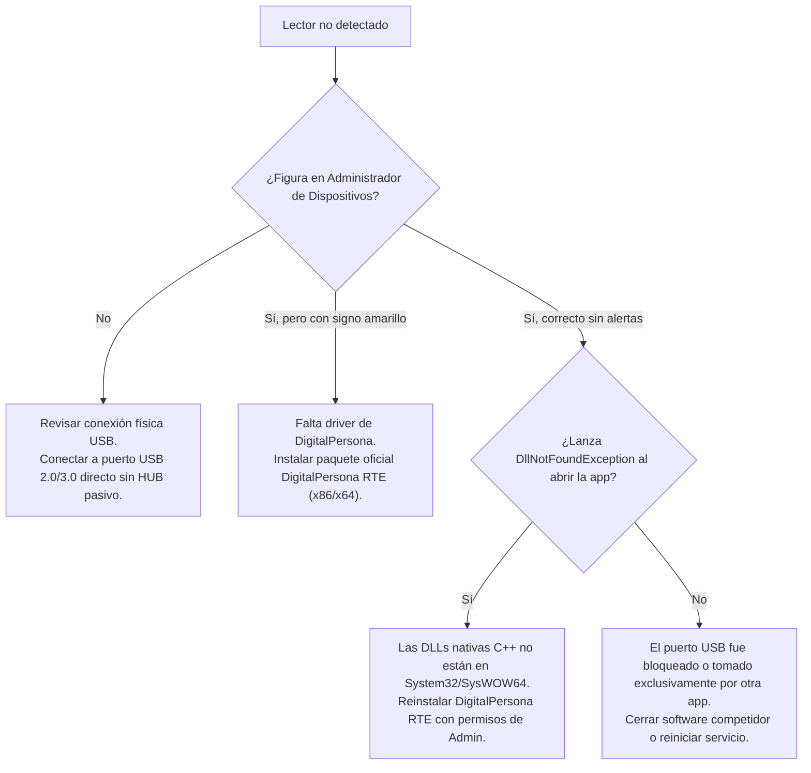

# Guía de Resolución de Problemas (Troubleshooting) — Sistema Gimnasio

> [!NOTE]
> **Documento Operativo — Fase 4.** Esta guía proporciona árboles de decisión, diagnósticos técnicos y pasos de mitigación paso a paso para los incidentes más comunes en despliegues productivos y estaciones de desarrollo.

---

## Matriz Rápida de Diagnóstico

| Categoría | Síntoma Principal | Causa Frecuente | Solución Rápida |
| :--- | :--- | :--- | :--- |
| **Base de Datos** | Error 26 / 40 al iniciar la app | Servicio SQL detenido o protocolo TCP inactivo | Iniciar servicio `MSSQL$SQLEXPRESS01` y habilitar TCP/IP. |
| **Base de Datos** | Error 18456 (*Login failed*) | Usuario de Windows sin permisos en `SistemaGimnasio` | Asignar roles `db_datareader` y `db_datawriter` al usuario. |
| **Hardware** | Lector no enciende luz roja | Falta driver RTE del fabricante o cable USB suelto | Instalar DigitalPersona RTE y conectar a puerto USB directo. |
| **Hardware** | Error `DP_DEVICE_FAILURE` | Fluctuación de voltaje USB o desconexión en caliente | Desconectar y reconectar lector; el software recupera sin reiniciar. |
| **Biometría** | Huella no reconocida | Prisma sucio, dedo muy reseco o enrolamiento deficiente | Limpiar prisma con microfibra; re-enrolar con 4 tomas consistentes. |
| **Biometría** | Socio reconocido pero no ingresa | Membresía vencida o estado `Inactivo` | Registrar pago en módulo de cobranza para renovar vigencia. |
| **Caché / Datos**| Pago no se refleja en la puerta | Caché en estado de cooldown por microcorte SQL | Esperar expiración de cooldown (5s) o reabrir ventana de acceso. |
| **Build** | Faltan DLLs de DigitalPersona | Referencias no resuelven a la carpeta `libs/` | Ejecutar `scripts/verify-reproducibility.ps1` y compilar con MSBuild. |
| **Build** | Paquetes NuGet faltantes | `packages/` no restaurado tras clonar el repo | Ejecutar `msbuild /t:restore /p:RestorePackagesConfig=true`. |

---

## 1. Conectividad con Base de Datos (`GymDbConnection`)

### 1.1. Error 26 / Error 40: "Error al abrir la conexión con el servidor"
```text
System.Data.SqlClient.SqlException (0x80131904): Error relacionado con la red o específico de la instancia
a la que se hace referencia al conectarse a SQL Server. No se encontró el servidor o este no estaba accesible.
Error: 26 - Error al localizar el servidor/instancia especificado.
```

#### Causas Principales
1. El servicio de SQL Server está detenido.
2. La instancia indicada en `App.config` no coincide con la instalada en el equipo (por ejemplo, `.\SQLEXPRESS01` vs `.\SQLEXPRESS`).
3. El servicio **SQL Server Browser** está detenido en conexiones remotas.

#### Diagnóstico y Pasos de Mitigación
1. **Comprobar el estado del servicio SQL en PowerShell (como Administrador):**
   ```powershell
   Get-Service -Name "MSSQL*"
   ```
   Si el servicio figura como `Stopped`, inícielo:
   ```powershell
   Start-Service -Name 'MSSQL$SQLEXPRESS01'  # O el nombre de su instancia local
   ```
2. **Verificar la cadena en los archivos de configuración:**
   Abra [Sistema_Gimnasio/App.config](../Sistema_Gimnasio/App.config) y [BiometricApp/BiometricApp/BiometricApp/App.config](../BiometricApp/BiometricApp/BiometricApp/App.config) y asegúrese de que el parámetro `Data Source=` apunte a la instancia correcta:
   ```xml
   <connectionStrings>
       <add name="GymDbConnection"
            connectionString="Data Source=.\SQLEXPRESS01;Initial Catalog=SistemaGimnasio;Integrated Security=True"
            providerName="System.Data.SqlClient" />
   </connectionStrings>
   ```
3. **Probar conectividad directa con `sqlcmd`:**
   ```powershell
   sqlcmd -S .\SQLEXPRESS01 -E -Q "SELECT @@SERVERNAME, DB_NAME(DB_ID('SistemaGimnasio'));"
   ```
   Si este comando tiene éxito, la base de datos está en línea y accesible.

---

### 1.2. Error 18456: "Error de inicio de sesión del usuario"
```text
System.Data.SqlClient.SqlException: Error de inicio de sesión del usuario 'DOMINIO\usuario' (0x80131904).
```

#### Causa
El usuario de Windows que inició sesión en el equipo no cuenta con un Login en SQL Server o carece de permisos sobre la base de datos `SistemaGimnasio`.

#### Solución
Ejecute en SSMS o `sqlcmd` con una cuenta administradora:
```sql
USE master;
GO
CREATE LOGIN [DOMINIO\usuario] FROM WINDOWS;
GO
USE SistemaGimnasio;
GO
CREATE USER [Operador] FOR LOGIN [DOMINIO\usuario];
ALTER ROLE db_datareader ADD MEMBER [Operador];
ALTER ROLE db_datawriter ADD MEMBER [Operador];
GO
```

---

### 1.3. Desincronización entre `App.config`
Si `Sistema_Gimnasio` se conecta con éxito pero las pruebas biométricas standalone fallan, verifique la paridad de ambos archivos `App.config`:
```powershell
powershell -ExecutionPolicy Bypass -File scripts/verify-reproducibility.ps1
```
*El Check A del script validará de forma inmediata si ambas cadenas son idénticas caracter por caracter.*

---

## 2. Detección y Fallos del Lector DigitalPersona U.are.U 4500

### 2.1. El Lector no Enciende la Luz Roja y la App no Detecta Hardware
```text
Mensaje en UI: "Lector no conectado" o "No se encontraron lectores de huella compatibles."
```

#### Árbol de Diagnóstico


1. **Inspección en Administrador de Dispositivos (`devmgmt.msc`):**
   - Busque el dispositivo con Hardware ID `USB\VID_05BA&PID_000A`.
   - Si figura bajo *Otros dispositivos* como dispositivo desconocido, instale el instalador oficial de HID Global / DigitalPersona RTE.
2. **Puertos USB con Ahorro de Energía:**
   - En laptops o terminales todo en uno, Windows puede suspender la alimentación del puerto USB.
   - En `devmgmt.msc` > *Controladoras de bus serie universal* > *Concentrador raíz USB* > Propiedades > *Administración de energía*, desmarque la opción *"Permitir que el equipo apague este dispositivo para ahorrar energía"*.

---

### 2.2. Códigos de Error del SDK: `DP_DEVICE_FAILURE` y `DP_INVALID_DEVICE`
- **`DP_DEVICE_FAILURE`:** El hardware experimentó un fallo interno de comunicación, habitualmente provocado por una caída súbita de voltaje en el bus USB.
- **`DP_INVALID_DEVICE`:** El lector fue desconectado físicamente mientras una sesión asíncrona de captura (`CaptureAsync`) estaba en progreso.

#### Comportamiento Defensivo del Sistema (Fase 3):
En la Fase 3 se incorporó tolerancia a desconexión en [FingerprintManager.cs](../BiometricApp/BiometricApp/BiometricApp/FingerprintManager.cs):
- La aplicación **no se bloquea ni se cierra**.
- Se atrapa la excepción de hardware de forma segura.
- Se cancela la captura en curso y se liberan los bitmaps GDI+ pendientes sin fugas de memoria.
- Para restablecer el lector: simplemente desconecte y vuelva a conectar el cable USB; el sistema reanudará la captura al reabrir la ventana o presionar el botón de inicio del lector.

---

## 3. Reconocimiento de Huellas y Rechazo Falso (FRR)

### 3.1. Dedo Colocado pero Mensaje "Huella no reconocida"

#### Causas Físicas y Ambientales
1. **Prisma Sucio o Manchado:** Residuos de grasa de usuarios previos dispersan la luz del LED interno, provocando una imagen borrosa sin crestas nítidas.
   - *Solución:* Limpie el prisma con un paño de microfibra y alcohol isopropílico al 70%.
2. **Luz Solar Incidente:** Si el sensor recibe luz solar directa, los rayos infrarrojos saturan el sensor óptico CMOS.
   - *Solución:* Reubique el sensor o coloque una pantalla que bloquee la luz solar directa.
3. **Piel Excesivamente Reseca (Efecto Tiza/Magnesio):** En gimnasios de levantamiento de pesas o calistenia, los usuarios con magnesio o piel muy seca producen capturas de bajo contraste.
   - *Solución:* Pida al socio que frote la yema de su dedo contra su frente o dorso para aportar una pequeña capa de lípidos naturales antes de posar el dedo.

#### Causas de Software y Datos
1. **Mala Calidad del Enrolamiento Original:**
   - Si durante el alta del socio en [frmDBEnrollment.cs](../BiometricApp/BiometricApp/BiometricApp/frmDBEnrollment.cs) el operador aceptó lecturas descentradas o apresuradas, la plantilla FMD consolidada tendrá pocas minucias.
   - *Solución:* Ingrese a **Miembros** > Seleccione al socio > **Editar Miembro** ([FormEditar.cs](../Sistema_Gimnasio/FormEditar.cs)) y vuelva a enrolar la huella ejecutando con calma las 4 lecturas de confirmación requeridas.
2. **Socio Identificado pero Acceso Denegado:**
   - La pantalla muestra el nombre del socio pero indica "Acceso Denegado / Membresía Vencida".
   - *Explicación:* El reconocimiento biométrico 1:N fue **100% exitoso**, pero la regla de negocio evaluó que `estado != 'Activo'` o `fechaFin < DateTime.Now`.
   - *Solución:* Diríjase al módulo de cobranza ([PagoButWindow.xaml.cs](../Sistema_Gimnasio/PagoButWindow.xaml.cs)) y registre la renovación del plan.

---

## 4. Desincronización de Datos y Comportamiento de `BiometricCache`

### 4.1. El Socio Renovó su Pago pero el Lector Sigue Reportándolo como Vencido
En la Fase 3, la caché biométrica in-memory almacena un snapshot inmutable para máxima velocidad.

#### Ciclo de Actualización Normal
Cuando se registra un pago en `PagoButWindow.xaml.cs` o se edita un miembro en `FormEditar.cs`:
1. La capa de negocio invoca el contrato neutro [NotificadorCambioMiembro](../Gym_System.Core/Gym_System.Core/NotificadorCambioMiembro.cs).
2. [App.xaml.cs](../Sistema_Gimnasio/App.xaml.cs) dispara `BiometricCache.Invalidar()`.
3. La caché incrementa su contador interno de versión (`_version++`) y marca `_necesitaRecarga = true`.
4. En el siguiente escaneo físico en la puerta, la caché detecta el cambio de versión y recarga el registro desde la base de datos de manera atómica.

#### Diagnóstico ante Retrasos
- **¿Ocurrió un error transitorio de red SQL?**
  Si la base de datos se reinició o tuvo un microcorte justo al momento de la verificación, `BiometricCache` entra en estado de enfriamiento (`EnCooldown = true`) durante 5 segundos para proteger el hilo del hardware contra bloqueos y saturación de conexiones.
- **Acción:** Espere 5 segundos a que expire el cooldown de protección y repita el escaneo. La caché completará la recarga automáticamente.
- Alternativamente, cierre y vuelva a abrir la ventana de [SistemaAcceso.xaml](../Sistema_Gimnasio/SistemaAcceso.xaml.cs) para forzar un ciclo limpio de inicialización.

---

## 5. Problemas de Compilación y Entorno de Desarrollo

### 5.1. Error MSB3245: "No se pudo resolver esta referencia: DPUruNet..."
```text
warning MSB3245: No se pudo resolver esta referencia. No se encuentra el ensamblado "DPUruNet".
error CS0246: El nombre del tipo o del espacio de nombres 'DPUruNet' no se encontró
```

#### Causa
Los archivos de proyecto `.csproj` buscan los ensamblados del SDK en la ruta relativa `libs/`. Si las DLLs fueron eliminadas o movidas, el compilador fallará.

#### Mitigación
1. Verifique que los 4 archivos existan físicamente en la carpeta `libs/`:
   - `libs/DPUruNet.dll`
   - `libs/DPCtlUruNet.dll`
   - `libs/DPXUru.dll`
   - `libs/DPCtlXUru.dll`
2. Ejecute el script de validación estática:
   ```powershell
   powershell -ExecutionPolicy Bypass -File scripts/verify-reproducibility.ps1
   ```
   *El Check C validará la presencia de las referencias y de los archivos en disco.*

---

### 5.2. Paquetes NuGet Faltantes al Clonar el Repositorio
```text
error CS0246: El nombre del tipo o del espacio de nombres 'MahApps' no se encontró
error CS0246: El nombre del tipo o del espacio de nombres 'NodaTime' no se encontró
```

#### Mitigación
Restaure los paquetes NuGet con MSBuild indicando explícitamente la directiva `RestorePackagesConfig`:
```powershell
msbuild Sistema_Gimnasio.sln /t:restore /p:RestorePackagesConfig=true
```

---

### 5.3. Invocación Correcta de MSBuild en Windows
Si el comando genérico `msbuild` no se reconoce en su terminal, utilice la ruta canónica de Visual Studio 2022 / 2026:
```powershell
& "C:\Program Files\Microsoft Visual Studio\18\Community\MSBuild\Current\Bin\MSBuild.exe" Sistema_Gimnasio.sln /p:Configuration=Debug
```
*O en instalaciones con Build Tools:*
```powershell
& "C:\Program Files (x86)\Microsoft Visual Studio\18\BuildTools\MSBuild\Current\Bin\MSBuild.exe" Sistema_Gimnasio.sln /p:Configuration=Debug
```
