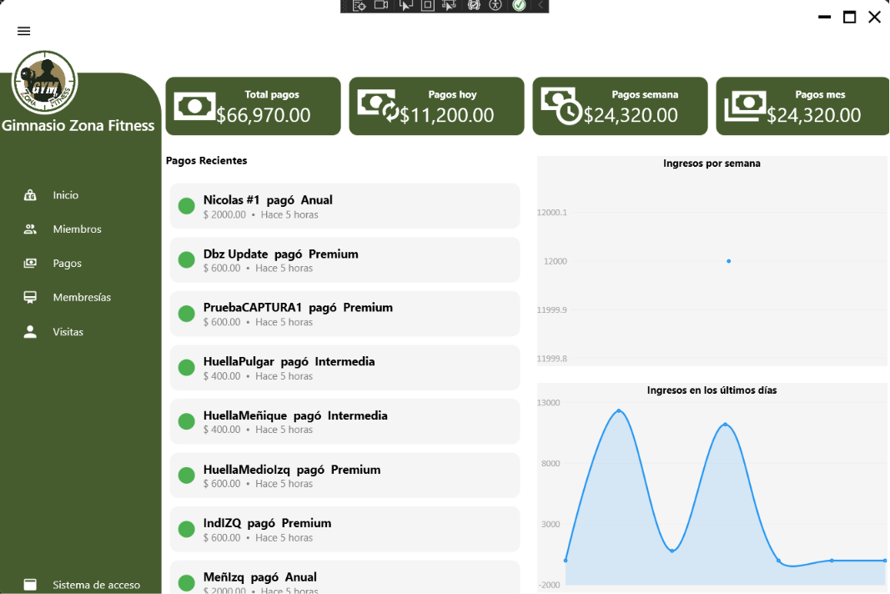
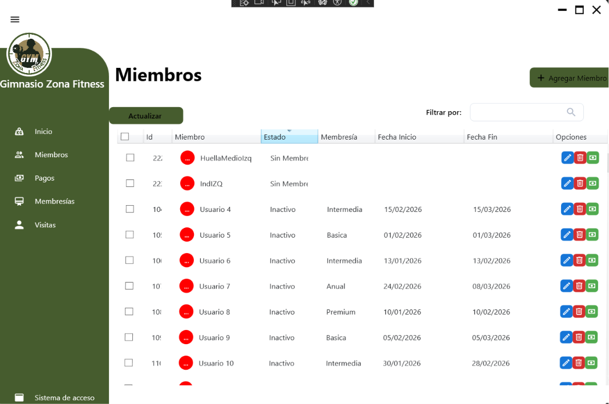
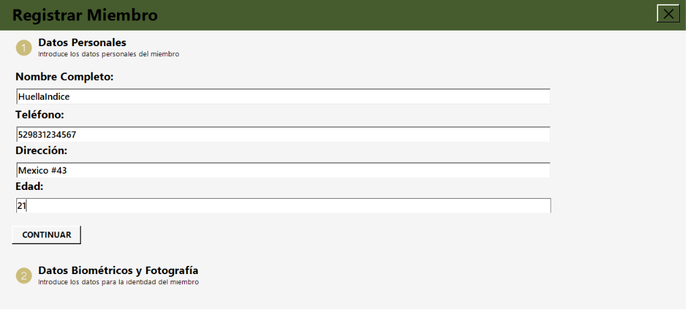
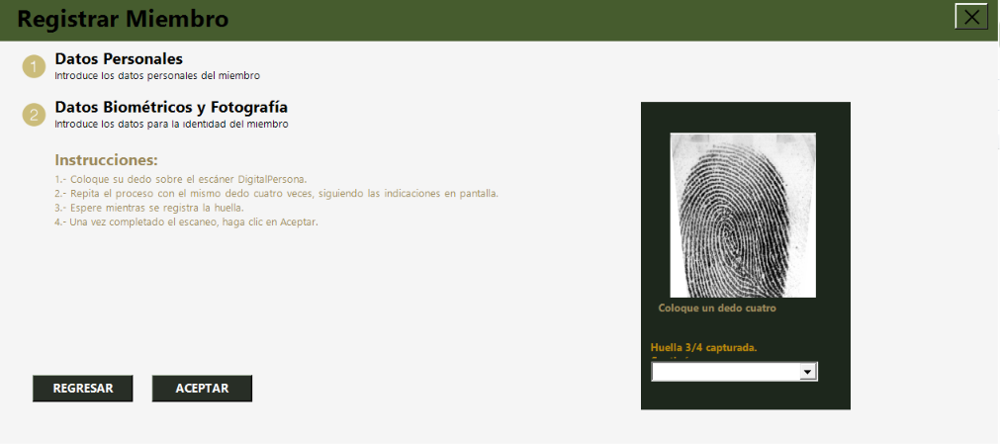
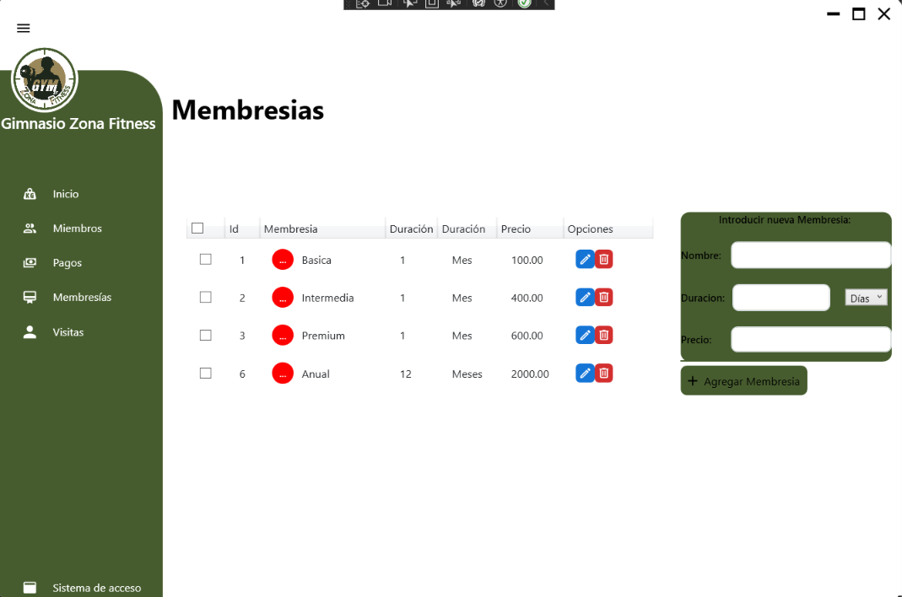
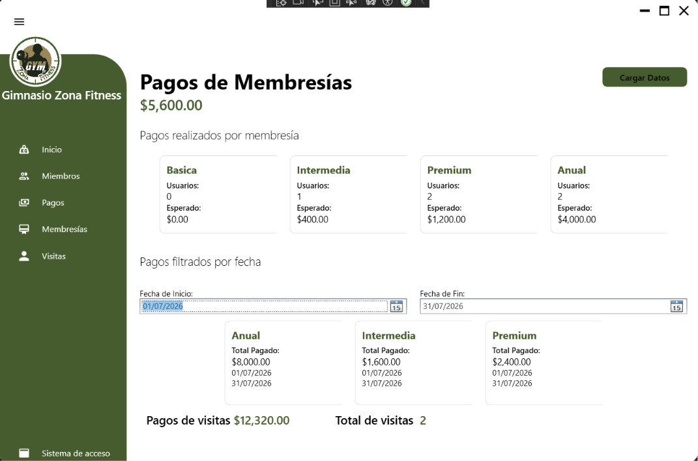
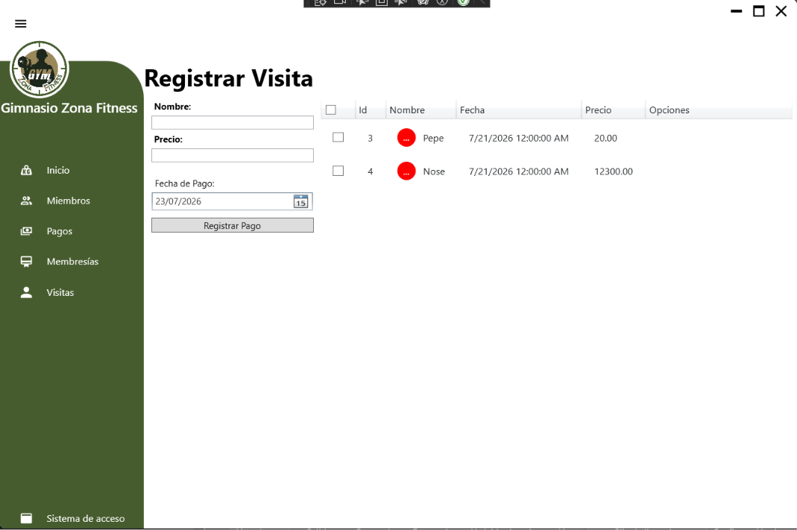

# 🏋️ Gym Management System with Biometric Authentication


Sistema de administración para gimnasios desarrollado en **C# (.NET Framework)** que integra **WinForms**, **WPF**, **SQL Server** y autenticación biométrica mediante lectores **DigitalPersona U.are.U**.

El proyecto permite administrar miembros, membresías, pagos y controlar el acceso mediante reconocimiento de huella digital.

---

#  Características

-  Registro y administración de miembros.
-  Enrolamiento biométrico mediante DigitalPersona.
-  Verificación de identidad por huella digital.
-  Administración de membresías.
-  Registro e historial de pagos.
-  Registro de visitas.
-  Base de datos SQL Server.
-  Arquitectura modular separando la lógica biométrica del sistema principal.

---

# 🛠 Tecnologías

| Tecnología | Descripción |
|------------|-------------|
| C# | Lenguaje principal |
| .NET Framework | Plataforma de desarrollo |
| WinForms | Interfaces administrativas |
| WPF | Sistema de control de acceso |
| SQL Server | Base de datos |
| ADO.NET | Acceso a datos |
| DPUruNet SDK | Integración biométrica DigitalPersona |

---

#  Requisitos

- Visual Studio 2022
- SQL Server Express (o superior)
- .NET Framework
- DigitalPersona SDK
- Lector DigitalPersona U.are.U 4500

---

#  Base de datos

El proyecto incluye el respaldo de la base de datos.

```
Database/
└── SistemaGimnasio.bak
```

Una vez restaurada la base de datos, actualiza la cadena de conexión correspondiente en:

```
App.config
```

---

#  DigitalPersona SDK

Por motivos de licencia **las DLL del SDK no se incluyen en este repositorio**.

Para ejecutar el proyecto es necesario instalar el **DigitalPersona U.are.U SDK** y agregar las referencias correspondientes.

---

#  Capturas del sistema

##  Dashboard

<p align="center">

</p>

Pantalla principal desde donde se administran todos los módulos del sistema.

---

##  Gestión de miembros

<p align="center">

</p>

Administración completa de los miembros registrados.

---

##  Registro de miembros

<p align="center">


</p>

Proceso de registro dividido en dos etapas:

- Información personal.
- Enrolamiento biométrico mediante lector DigitalPersona.

---

## 💳 Gestión de membresías

<p align="center">

</p>

Creación, modificación y administración de los distintos tipos de membresías.

---

## Gestión de pagos

<p align="center">

</p>

Consulta del historial de pagos registrados.

---

## Registro de pagos

Registro de nuevos pagos y actualización automática de la vigencia de la membresía.

---

## Gestión de visitas

<p align="center">

</p>

Registro y control de visitantes.

---

# Arquitectura del proyecto

```
GymManagementSystem/
│
├── BiometricApp/
│   ├── Fingerprint Enrollment
│   ├── Fingerprint Verification
│   └── DigitalPersona Integration
│
├── Sistema_Gimnasio/
│   ├── Member Management
│   ├── Memberships
│   ├── Payments
│   ├── Visits
│   └── Access Control
│
├── Database/
│
├── Docs/
│   └── Images/
│
└── README.md
```

---

# 📚 Referencias

Dashboard (WPF)

https://youtu.be/mlmyFXJy8gQ?si=VXKKKBo_pvUkGP_0

DigitalPersona U.are.U SDK

https://youtu.be/j-h5GsKoi1g?si=ed1JnvJ3HHH0ZS2A

---

#  Estado del proyecto

No esta en desarrollo activo por el momento

Características implementadas:

- ✔ Gestión de miembros
- ✔ Gestión de membresías
- ✔ Registro de pagos
- ✔ Registro de visitas
- ✔ Enrolamiento biométrico
- ✔ Verificación biométrica
- ✔ Control de acceso mediante huella digital

---

#  Licencia

Este proyecto está distribuido bajo la licencia **MIT**.

Consulta el archivo **LICENSE** para más información.
