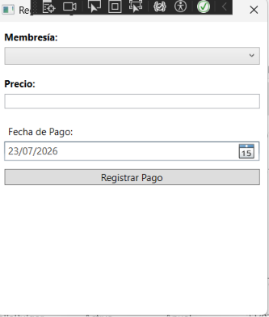
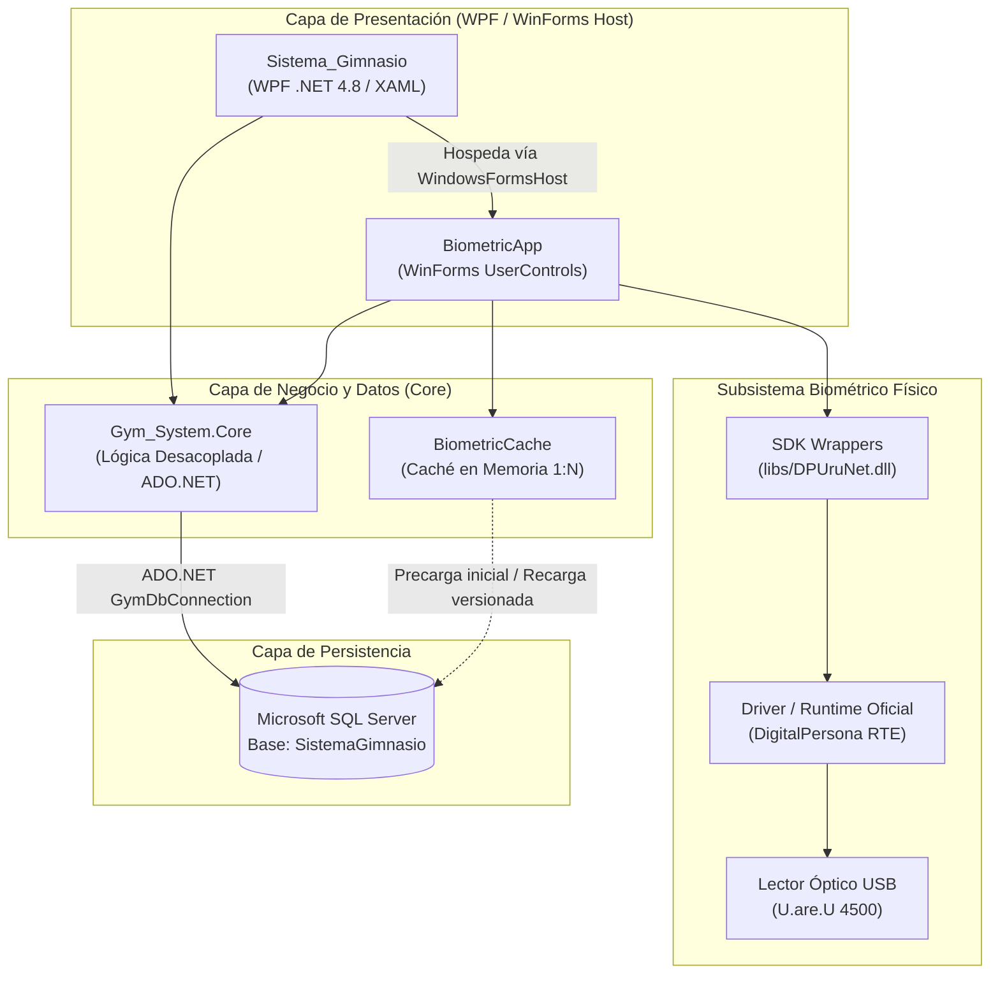

# Sistema de Gestión y Control Biométrico para Gimnasios (Gym System)

[](https://dotnet.microsoft.com/)
[](https://learn.microsoft.com/dotnet/csharp/)
[](https://learn.microsoft.com/dotnet/desktop/wpf/)
[](https://www.microsoft.com/sql-server/)
[](https://www.hidglobal.com/)
[](LICENSE)

Solución de escritorio integral desarrollada en **C# y .NET Framework 4.8** para la administración, control financiero y registro de accesos en gimnasios y centros deportivos. Incorpora identificación biométrica de alta velocidad por huella dactilar (**DigitalPersona U.are.U 4500**) con motor de comparación 1:N asistido por caché en memoria, gestión automatizada de membresías con vigencia acumulativa, cobranza transaccional atómica y reportes operativos en tiempo real.

---

## 📸 Galería del Sistema

Capturas de pantalla reales de la interfaz gráfica y los módulos en operación:

### 1. Panel Principal e Inicio (Dashboard)
Resumen operativo del centro deportivo: métricas clave de asistencia, socios activos, ingresos del período y accesos rápidos a las funciones principales.


### 2. Directorio y Gestión de Miembros
Control integral del padrón de socios: listado con búsqueda en tiempo real, filtrado por estado de vigencia y actualización masiva de estados sin bloqueos en la base de datos.


### 3. Registro y Enrolamiento Biométrico
Alta de nuevos miembros integrada con captura biométrica: proceso asistido de cuatro muestras dactilares sobre el lector óptico para consolidar una plantilla FMD de alta fidelidad.

| Formulario de Registro | Captura de Huella (DigitalPersona) |
| :---: | :---: |
|  |  |

### 4. Catálogo de Membresías
Administración de planes tarifarios, duraciones configurables (días, meses, anualidades) y privilegios de acceso para los diferentes perfiles de entrenamiento.


### 5. Control de Pagos y Renovación de Vigencia
Módulo de caja para registro de cobros con actualización de vigencia acumulativa automática (adicionando días restantes a socios con suscripción vigente) e historial transaccional.

| Historial de Cobranza | Registro de Pago y Facturación |
| :---: | :---: |
|  |  |

### 6. Control de Asistencia y Visitas
Bitácora de entradas en tiempo real mediante autenticación biométrica en recepción, con validación inmediata de estatus de membresía y prevención de accesos no autorizados.


---

## 🚀 Características Principales

- **Identificación Biométrica 1:N Optimizada:** Verificación instantánea contra el padrón completo mediante `BiometricCache`, un almacén en memoria RAM de plantillas deserializadas (`DPUruNet.Fmd`). Elimina consultas SQL recurrentes a la tabla completa y deserializaciones XML en cada escaneo físico.
- **Enrolamiento Robusto de 4 Tomas:** Flujo asistido que recopila 4 muestras consistentes de la huella dactilar antes de generar la plantilla final, minimizando la tasa de falsos rechazos (FRR).
- **Cobranza Atómica y Vigencia Acumulativa:** Transacciones de pago bajo bloqueo de fila (`UPDLOCK, ROWLOCK`) gestionadas por `VigenciaCalculador`. Si un socio renueva su suscripción antes de que expire, la nueva vigencia se añade a sus días activos restantes en lugar de reiniciar desde la fecha actual.
- **Actualización de Estados sin Bucle N+1:** Método masivo en SQL (`ActualizarEstadosMasivo`) que evalúa y sincroniza las fechas de expiración de todos los miembros en una única sentencia `UPDATE` con expresión condicional `CASE`, ejecutándose de manera silenciosa sin ventanas emergentes repetitivas.
- **Reportes Financieros Precisos:** Consultas analíticas de ingresos y visitas construidas sobre rangos de fecha semiabiertos (`< FinExclusivo`), evitando omisiones transaccionales por fracciones de segundo y suprimiendo productos cartesianos en joins de membresías.
- **Resiliencia Operativa y Ciclo de Vida Seguro:** Gestión tolerante ante desconexión o fallas del lector USB (`DP_DEVICE_FAILURE`, `DP_INVALID_DEVICE`), callbacks aislados y período de enfriamiento (*cooldown*) automático ante microcortes en la base de datos para prevenir saturación del sistema.

---

## 🏗️ Arquitectura y Stack Tecnológico

### Stack Tecnológico
- **Lenguaje:** C# sobre .NET Framework 4.8 (versión efectiva determinada por el compilador de Visual Studio/MSBuild del entorno)
- **Capa de Presentación (UI):** Windows Presentation Foundation (WPF / XAML) con estilos vectoriales de `MahApps.Metro.IconPacks` e integración de controles Windows Forms mediante `WindowsFormsHost` para hospedar los diálogos de captura biométrica.
- **Capa de Lógica de Negocio y Datos:** `Gym_System.Core` (ensamblado de clases puramente desacoplado, sin dependencias de `System.Windows.Forms` ni de `MessageBox`).
- **Persistencia de Datos:** Microsoft SQL Server / SQL Server Express conectado vía ADO.NET (`System.Data.SqlClient`).
- **Hardware y SDK Biométrico:** Lector óptico DigitalPersona U.are.U 4500 con librerías nativas administradas en .NET (`DPUruNet.dll`, `DPCtlUruNet.dll`, `DPXUru.dll`, `DPCtlXUru.dll`).

### Diagrama de Arquitectura



---

## 💻 Requisitos de Entorno y Hardware

- **Sistema Operativo:** Windows 10 o Windows 11 (x64 recomendado).
- **Entorno de Desarrollo:** Visual Studio 2022 (con la carga de trabajo *Desarrollo de escritorio de .NET* instalada).
- **Framework:** .NET Framework 4.8 Developer Pack / Runtime.
- **Motor de Base de Datos:** Microsoft SQL Server 2019 o superior / SQL Server Express compatible (instancia local sugerida: `.\SQLEXPRESS01`).
- **Dispositivo Biométrico:** Lector óptico de huellas dactilares DigitalPersona U.are.U 4500 (USB) para capturas y validaciones físicas en vivo.
- **Drivers / Runtime del Fabricante:** DigitalPersona RTE (Real-Time Environment) instalado en el sistema operativo host.
- **Resolución de Dependencias:** Los archivos de proyecto (`Sistema_Gimnasio.csproj` y `BiometricApp.csproj`) resuelven los ensamblados del SDK de forma relativa desde el directorio versionado `libs/`, garantizando independencia de rutas absolutas locales a `Program Files`.

---

## ⚙️ Instalación y Puesta en Marcha

### 1. Despliegue de la Base de Datos
1. Abra SQL Server Management Studio (SSMS) o una terminal con la utilidad de línea de comandos `sqlcmd`.
2. Conéctese a su instancia de SQL Server (por ejemplo, `.\SQLEXPRESS01`).
3. Ejecute el script DDL ubicado en el repositorio:
   ```text
   database/SistemaGimnasio.sql
   ```
   Este script inicializa la base de datos `SistemaGimnasio` y genera las tablas `Membresias`, `Miembros`, `Pagos` y `Visitas`. Para lineamientos de privilegios mínimos (*least-privilege*), consulte [Docs/DEPLOYMENT.md](Docs/DEPLOYMENT.md).

### 2. Configuración de Conexión (`App.config`)
El sistema centraliza el acceso a datos en la cadena de conexión `GymDbConnection`. Por defecto, se encuentra parametrizada para autenticación integrada de Windows (`Integrated Security=True`):

```xml
<connectionStrings>
    <add name="GymDbConnection"
         connectionString="Data Source=.\SQLEXPRESS01;Initial Catalog=SistemaGimnasio;Integrated Security=True"
         providerName="System.Data.SqlClient" />
</connectionStrings>
```

> [!IMPORTANT]
> **Paridad obligatoria de configuración:** Si el módulo biométrico se prueba o ejecuta de forma independiente, requiere su propia definición en `BiometricApp/BiometricApp/BiometricApp/App.config`. Ambos archivos (`Sistema_Gimnasio/App.config` y el de `BiometricApp`) deben mantener exactamente la misma cadena de conexión hacia la base de datos.

### 3. Librerías del SDK y Controladores Propietarios
Las bibliotecas de interoperabilidad .NET (`DPCtlUruNet.dll`, `DPCtlXUru.dll`, `DPUruNet.dll`, `DPXUru.dll`) se encuentran provistas en el directorio `libs/` del repositorio, permitiendo compilar la solución de inmediato sin necesidad de ubicar archivos en directorios del sistema.

> [!WARNING]
> **Adquisición de controladores oficiales:** Para que la aplicación reconozca el lector óptico físico en tiempo de ejecución, es indispensable contar con los controladores de hardware y el runtime oficial DigitalPersona RTE instalados en Windows. Estos componentes no están incluidos en el repositorio por ser software propietario y deben adquirirse a través de los canales oficiales del fabricante.

### 4. Restauración de Paquetes NuGet
Antes de compilar el proyecto, asegúrese de restaurar los paquetes externos:
- **Desde Visual Studio:** Clic derecho sobre la solución `Sistema_Gimnasio.sln` > **Restaurar paquetes NuGet**.
- **Desde la terminal (MSBuild):**
  ```shell
  msbuild Sistema_Gimnasio.sln /t:restore /p:RestorePackagesConfig=true
  ```

### 5. Compilación del Proyecto
Abra `Sistema_Gimnasio.sln` en Visual Studio 2022 y compile en configuración `Debug` o `Release` (Any CPU), o utilice MSBuild desde Developer Command Prompt o PowerShell:
```shell
msbuild Sistema_Gimnasio.sln /p:Configuration=Debug
```

---

## 🧪 Pruebas Automatizadas y Verificación

El repositorio dispone de una suite de validación automatizada mediante scripts en PowerShell diseñados para verificar la integridad del código, la consistencia de configuraciones y la robustez lógica de los componentes sin requerir hardware conectado ni instancias SQL activas.

### Comandos de Verificación Disponibles

```powershell
# 1. Verificación estática de reproducibilidad y consistencia general
powershell -ExecutionPolicy Bypass -File scripts/verify-reproducibility.ps1

# 2. Validación de lógica transaccional, vigencias acumulativas y reportes (Fase 2)
powershell -ExecutionPolicy Bypass -File scripts/test-phase2.ps1

# 3. Validación de robustez biométrica, ciclo de vida y BiometricCache en memoria (Fase 3)
powershell -ExecutionPolicy Bypass -File scripts/test-phase3.ps1

# 4. Auditoría de enlaces Markdown, documentación de despliegue y guardrails (Fase 4)
powershell -ExecutionPolicy Bypass -File scripts/test-phase4.ps1

# 5. Compilación de solución completa por línea de comandos
msbuild Sistema_Gimnasio.sln /p:Configuration=Debug
```

### Matriz de Validación Técnica: Qué Está Validado vs Qué Requiere Entorno Real

| Aspecto | Validado en Scripts Locales / CI | Requiere Hardware Físico o SQL Server Activo |
| :--- | :---: | :---: |
| **Paridad de cadenas de conexión** (`App.config`) | ✅ Verificado estáticamente | ❌ N/A |
| **Ausencia de secretos y cadenas hardcodeadas** | ✅ Verificado estáticamente | ❌ N/A |
| **Resolución relativa de ensamblados SDK (`libs/`)** | ✅ Verificado estáticamente | ❌ N/A |
| **Desacoplamiento arquitectónico (Cero UI en Core)** | ✅ Verificado estáticamente | ❌ N/A |
| **Cálculo de vigencia acumulativa (`VigenciaCalculador`)** | ✅ Seam unit tests en memoria (Roslyn) | ❌ N/A |
| **Lógica multihilo y cooldown en `BiometricCache`** | ✅ Emulación y tests unitarios dinámicos | ❌ N/A |
| **Manejo defensivo de fallas USB (`DP_DEVICE_FAILURE`)** | ✅ Validado en árbol sintáctico | ❌ N/A |
| **Integridad y existencia física de enlaces Markdown** | ✅ Validado dinámicamente en disco | ❌ N/A |
| **Captura física de huellas con prisma óptico** | ❌ No simulable en software puro | ⚠️ Requiere lector DigitalPersona U.are.U 4500 |
| **Comunicación con servicio de drivers RTE nativos** | ❌ No simulable en software puro | ⚠️ Requiere runtime oficial en Windows |
| **Creación real de base de datos e índices** | ❌ Validación sintáctica del DDL | ⚠️ Requiere instancia SQL Server en ejecución |
| **Ejecución real de respaldos y restauración drill** | ✅ Guardrails validados con `-WhatIf` | ⚠️ Requiere servicio SQL activo con storage |

> [!NOTE]
> **Transparencia técnica:** Las comprobaciones automatizadas garantizan que la arquitectura, los seams de prueba y el código fuente compilan y responden a casos controlados. El usuario confirmó una prueba física satisfactoria del lector DigitalPersona U.are.U 4500 en su entorno. La creación de la base de datos y los respaldos/restauraciones reales deben validarse en la instancia SQL Server de cada instalación.

---

## 📚 Documentación Operativa y Guías Especializadas

Para profundizar en los procedimientos de instalación, mantenimiento continuo y soporte técnico, consulte la documentación oficial en `Docs/`:

- 📘 [Manual Integral de Despliegue e Instalación (Docs/DEPLOYMENT.md)](Docs/DEPLOYMENT.md): Topologías monopuesto y cliente-servidor en red local, puesta en marcha de SQL Server / SQL Express, ejecución de [database/SistemaGimnasio.sql](database/SistemaGimnasio.sql), política de permisos mínimos (*least-privilege* con roles `db_datareader`/`db_datawriter`), autenticación integrada de Windows y despliegue del runtime DigitalPersona.
- 📙 [Manual de Operación, Respaldos y Mantenimiento (Docs/OPERATIONS.md)](Docs/OPERATIONS.md): Justificación y configuración del modelo de recuperación `SIMPLE`, automatización de respaldos con [scripts/Backup-Database.ps1](scripts/Backup-Database.ps1) y [scripts/backup-database.sql](scripts/backup-database.sql), simulacro seguro de restauración aislada con [scripts/restore-drill.sql](scripts/restore-drill.sql), retención rotativa y cuidados físicos del sensor óptico.
- 📕 [Guía de Resolución de Problemas (Docs/TROUBLESHOOTING.md)](Docs/TROUBLESHOOTING.md): Árboles de diagnóstico para caídas de conexión SQL (Errores 26, 40, 18456), detección del hardware biométrico (`DP_DEVICE_FAILURE`, `DP_INVALID_DEVICE`), mitigación de factores dérmicos y prisma sucio, comportamiento del cooldown en `BiometricCache` y resolución de incidencias en compilación MSBuild.
- 🗄️ [Script DDL de Base de Datos (database/SistemaGimnasio.sql)](database/SistemaGimnasio.sql): Estructura relacional completa en formato UTF-8 estricto.
- 📄 [Licencia del Software (LICENSE)](LICENSE): Términos legales bajo licencia libre y permisiva MIT.

---

## 🔗 Referencias y Agradecimientos

- [Tutorial Dashboard XAML en C#](https://youtu.be/mlmyFXJy8gQ?si=VXKKKBo_pvUkGP_0): Referencia de maquetación y diseño de interfaz gráfica en WPF.
- [Tutorial DigitalPersona U.are.U SDK en C#](https://youtu.be/j-h5GsKoi1g?si=ed1JnvJ3HHH0ZS2A): Referencia para la integración del SDK de huella dactilar.

---

## ⚖️ Licencia

Distribuido bajo los términos de la Licencia MIT. Consulte el archivo [LICENSE](LICENSE) para más detalles.
